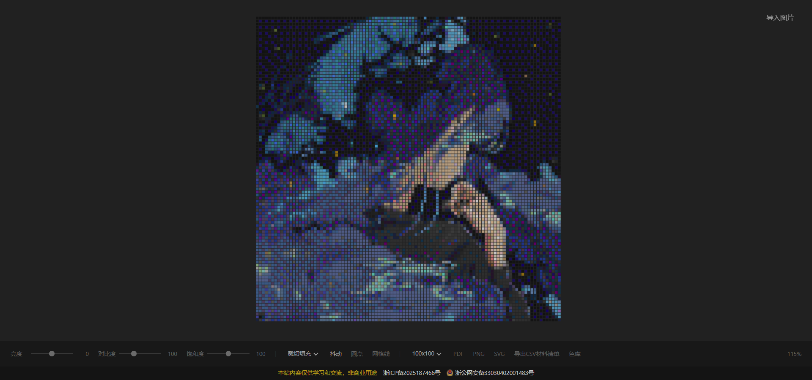

# 拼豆底卡生成器

一个纯前端的 Web 工具，将任意图片转换为拼豆（Fuse Bead）底卡图案，方便手工制作拼豆作品。

## 功能

- **图片导入** - 点击按钮或拖拽图片到页面即可导入
- **图像调整** - 支持亮度、对比度、饱和度实时调节
- **网格预设** - 30x30、50x50、100x100 及自定义尺寸
- **显示模式** - 抖动（Dithering）算法、圆点视图、网格线切换
- **缩放适配** - 裁切填充（Cover）和完整适配（Contain）两种模式
- **颜色库** - 内置标准拼豆色板，按色系分组，支持搜索、导入/导出 CSV
- **多格式导出**
  - PDF 矢量图纸（支持分页打印）
  - PNG 位图
  - SVG 矢量图
  - CSV 材料清单（含颜色编码和数量统计）
- **键盘快捷键** - Ctrl/Shift + 滚轮缩放，Ctrl+0 重置视图

## 技术栈

- 纯原生 HTML / CSS / JavaScript，无框架依赖
- Canvas 2D 渲染引擎
- 外部库（CDN 引入）：
  - [Papa Parse](https://www.papaparse.com/) - CSV 解析
  - [jsPDF](https://github.com/parallax/jsPDF) - PDF 生成

## 快速开始

直接用浏览器打开 `index.html` 即可使用。

## 使用说明

1. 点击右上角"导入图片"按钮或拖拽图片到页面
2. 在下方的控制栏中调整亮度、对比度、饱和度
3. 选择合适的网格尺寸（30/50/100 或自定义）
4. 可选开启抖动、圆点模式或网格线
5. 使用滚轮缩放画布，拖拽平移查看
6. 点击 PDF/PNG/SVG 按钮导出图纸，或点击 CSV 导出材料清单

## 截图

