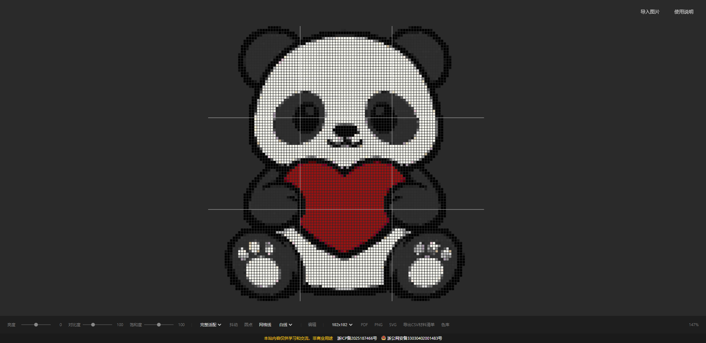
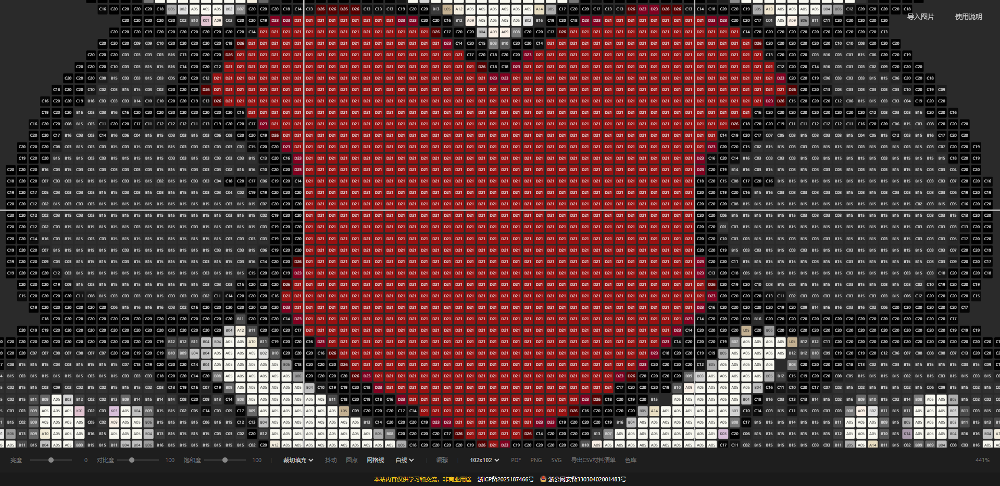

# 拼豆底卡生成器

一个纯前端的 Web 工具，将任意图片转换为拼豆底卡图案，方便手工制作拼豆作品。

## 功能

- **图片导入** - 点击右上角「导入图片」按钮，或直接将图片拖拽到页面中
- **图像调整** - 支持亮度、对比度、饱和度实时调节
- **缩放适配** - 裁切填充和完整适配两种模式
- **显示模式**
  - 抖动算法 - 让颜色过渡更自然
  - 圆点模式 - 以圆形代替方块显示
  - 网格线 - 支持白线/黑线/红线/蓝线四色切换
- **网格预设** - 36x36、57x57、78x78、102x102 及自定义尺寸
- **编辑模式** - 开启后可点击任意格子，手动输入色号修改颜色
- **颜色库** - 内置 264 色标准拼豆色板，支持按色系分组浏览、搜索色号、导入/导出 CSV
- **多格式导出**
  - PDF 矢量图纸（支持分页打印）
  - PNG 位图
  - SVG 矢量图
  - CSV 材料清单（含各颜色数量和编码）
- **键盘快捷键**
  - Ctrl/Shift + 滚轮：缩放画布
  - Ctrl + 0：重置视图
  - 滚轮：上下滚动 / 按住拖拽平移

## 技术栈

- 纯原生 HTML / CSS / JavaScript，无框架依赖
- Canvas 2D 渲染引擎
- 外部库（CDN 引入）：
  - [Papa Parse](https://www.papaparse.com/) - CSV 解析
  - [jsPDF](https://github.com/parallax/jsPDF) - PDF 生成

## 快速开始

直接用浏览器打开 `index.html` 即可使用。页面右上角有「使用说明」按钮，点击可查看本页内容。

## 使用说明

1. 点击右上角「导入图片」按钮，或将图片直接拖拽到页面中
2. 在底部控制栏中调整亮度、对比度、饱和度
3. 选择合适的网格尺寸（36/57/78/102 或自定义）
4. 可选操作：
   - 开启/关闭抖动算法
   - 切换圆点视图
   - 切换网格线颜色
   - 开启「编辑」模式，点击任意格子输入色号修改颜色
5. 使用滚轮缩放画布，拖拽平移查看细节
6. 点击底部 PDF/PNG/SVG 按钮导出图纸，或点击「导出CSV材料清单」生成用料统计
7. 点击「色库」可浏览所有颜色，支持搜索和 CSV 导入/导出

## 截图

